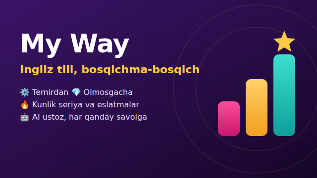
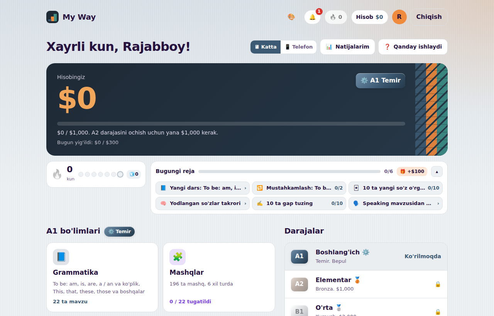
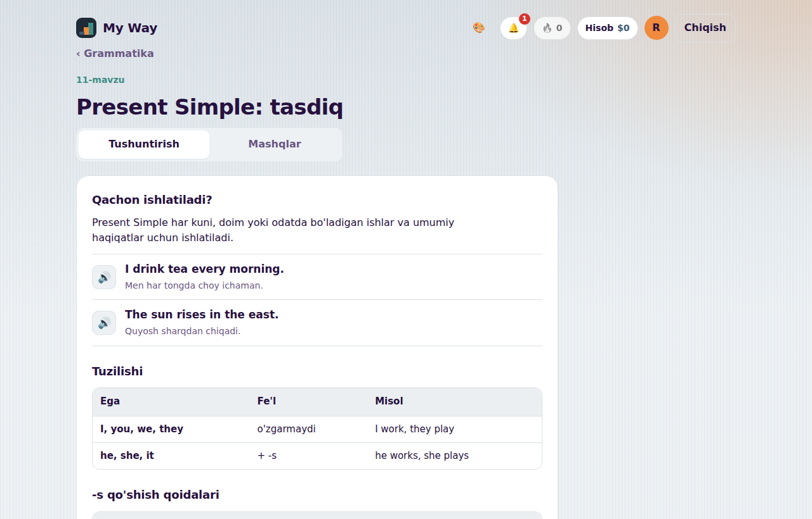
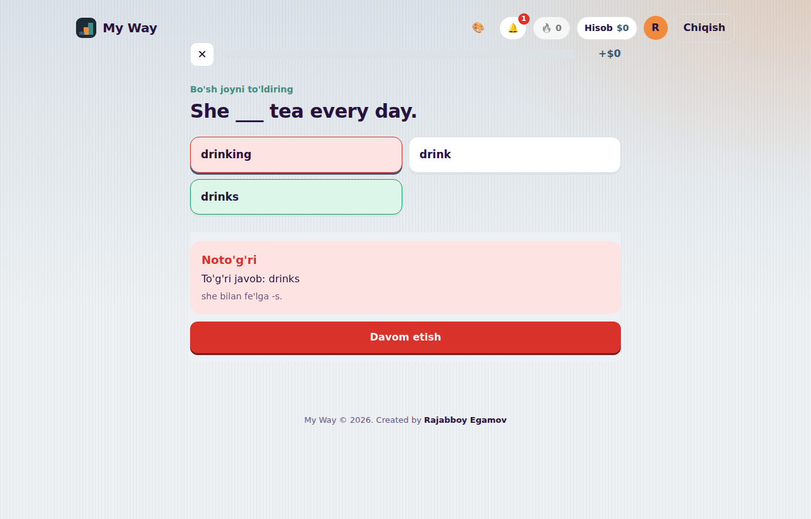
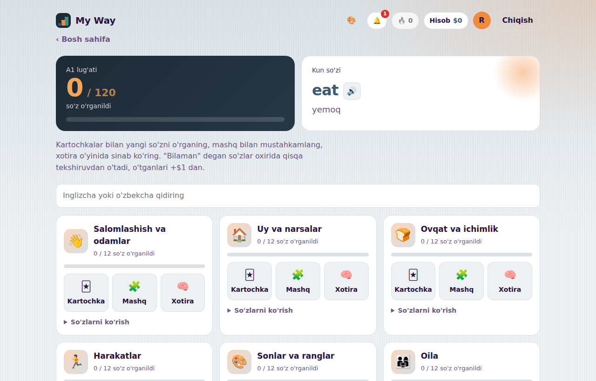
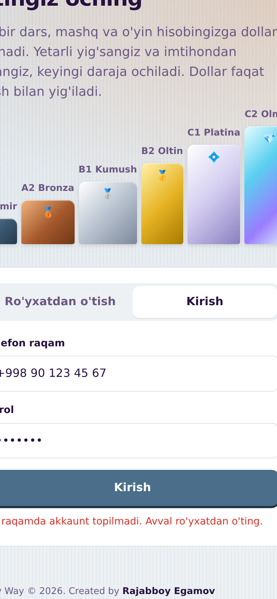
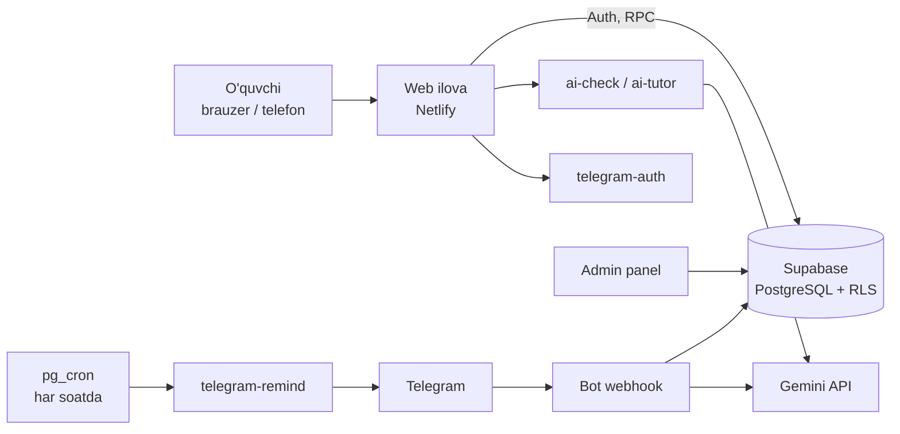

<p align="center">
  
</p>

<h1 align="center">My Way: ingliz tili, bosqichma-bosqich</h1>

<p align="center">
  O'zbek tilida so'zlashuvchilar uchun o'yinlashtirilgan ingliz tili platformasi.<br>
  <i>A gamified English-learning platform for Uzbek speakers.</i>
</p>

<p align="center">
  <a href="https://jovial-pony-1450fd.netlify.app"><b>🌐 Saytni ochish</b></a> ·
  <a href="https://t.me/My_Waytoenglish_bot"><b>🤖 Telegram bot</b></a>
</p>

---

## 📌 Loyiha haqida

**My Way** o'quvchini A1 dan C2 gacha olib boradi. O'quvchi dars va mashqlar orqali **virtual dollar** yig'adi, daraja imtihonidan o'tadi va keyingi darajani o'zi "sotib oladi". Har bir daraja o'z unvoni va rangiga ega: ⚙️ Temir, 🥉 Bronza, 🥈 Kumush, 🥇 Oltin, 💠 Platina, 💎 Olmos.

Dollarni faqat o'qish orqali yig'ish mumkin, uni pulga sotib olib bo'lmaydi. Shuning uchun hisobdagi har bir dollar haqiqiy bilimni ko'rsatadi.

## ✨ Imkoniyatlar

| | |
|---|---|
| 📘 **82 ta grammatika darsi** | Sodda o'zbekcha tushuntirish, jadvallar, ovozli misollar, "Diqqat" va "Eslab qoling" bloklari |
| 🧩 **6 xil mashq turi** | Tanlash, bo'sh joyni to'ldirish, tinglash, harflardan so'z, jumla tuzish, juftlash |
| 🔤 **720 ta so'z** | Kartochkalar, xotira o'yini, 60 soniyalik "So'z Blits" |
| 📝 **Daraja imtihoni va aniqlash testi** | 30 savol, taymer, zaif mavzular tahlili, sertifikat |
| 🔥 **Kunlik seriya va reja** | 6 ta shaxsiy vazifa, 100% uchun bonus, muzlatish |
| 🤖 **AI ustoz (Gemini)** | Tushunmagan mavzuni o'zbekcha tushuntiradi, gaplardagi xatolarni tuzatadi |
| 📲 **Telegram bot** | Telegram orqali kirish, natijalar, mini testlar, AI chat va avtomatik eslatmalar |
| 🛠 **Admin panel** | Dasturchisiz dars, mashq va lug'at qo'shish, statistika |
| 🎓 **IELTS va Speaking** | Band kalkulyator, Cue card trener, talaffuzni tekshirish |
| 📱 **Moslashuvchan dizayn** | Katta ekran va telefon ko'rinishlari, qorong'i rejim, 7 xil fon |

## 🖼 Skrinshotlar

| Bosh sahifa | Dars |
|---|---|
|  |  |
| **Mashq** | **Lug'at** |
|  |  |

<p align="center"></p>

## 🏗 Arxitektura



## 🛡 Xavfsizlik

- **Hisob-kitob faqat serverda.** Balans, daraja va mukofotlarni faqat `SECURITY DEFINER` funksiyalar o'zgartiradi. Foydalanuvchi o'z balansini to'g'ridan-to'g'ri o'zgartira olmaydi.
- **Javoblar serverda tekshiriladi.** Mashq va imtihon savollari brauzerga javobsiz yuboriladi, har bir javob `check_answer` RPC orqali baholanadi.
- **Row Level Security** barcha jadvallarda yoqilgan: har kim faqat o'z ma'lumotini ko'radi.
- **Firibgarlikka qarshi choralar:** kunlik $300 limiti, qayta o'tishda mukofot kamayishi (100%, 50%, 10%), juda tez javoblarga mukofot yo'q, imtihondan keyin kutish vaqti, server vaqti (O'zbekiston) bo'yicha seriya.
- **Telegram:** kirish ma'lumotlari rasmiy HMAC algoritmi bilan tekshiriladi, webhook maxfiy token bilan himoyalangan.
- **AI:** faqat ingliz tili mavzularida javob beradi, kunlik limit bor, maxfiy kalitlar faqat server secrets'da saqlanadi.

## 🧰 Texnologiyalar

- **Frontend:** HTML, CSS, vanilla JavaScript (framework'siz), Web Speech API
- **Backend:** Supabase (PostgreSQL, Auth, RLS, RPC, Edge Functions on Deno, pg_cron, pg_net)
- **AI:** Google Gemini API
- **Integratsiyalar:** Telegram Bot API, Telegram Login Widget
- **Hosting:** Netlify

## 📁 Tuzilma

```
web/
  index.html            asosiy ilova
  admin.html            admin panel
supabase/
  migrations/           baza sxemasi, RLS, RPC funksiyalar (tartib bilan)
  functions/            Edge Functions (Telegram, AI)
docs/                   skrinshotlar va brend rasmlari
```

> Dars kontenti (javoblar bilan) repozitoriyga ataylab kiritilmagan, chunki javoblar faqat serverda saqlanadi.

## 👤 Muallif

**Rajabboy Egamov**
G'oya, mahsulot dizayni va ishlab chiqish.

---

<details>
<summary><b>🇬🇧 English summary</b></summary>

**My Way** is a gamified English-learning platform for Uzbek speakers (CEFR A1 to C2). Learners earn virtual dollars through lessons and exercises, pass a level exam and "buy" the next level. Features: 82 grammar lessons with 6 exercise types, 720-word vocabulary with flashcards and games, level exams and placement test, daily streaks and personalised daily plans, a Gemini-powered AI tutor, a Telegram bot (login, stats, quizzes, AI chat, scheduled reminders) and an admin panel for no-code content management.

**Security:** all balances and rewards are computed server-side via Postgres `SECURITY DEFINER` functions; exercise answers never reach the client and are graded through RPC; Row Level Security on every table; anti-abuse limits and server-time streaks.

**Stack:** vanilla JS, Supabase (Postgres, Auth, RLS, Edge Functions, pg_cron), Gemini API, Telegram Bot API, Netlify.

</details>

<p align="center"><sub>© 2026 Rajabboy Egamov. All rights reserved.</sub></p>
